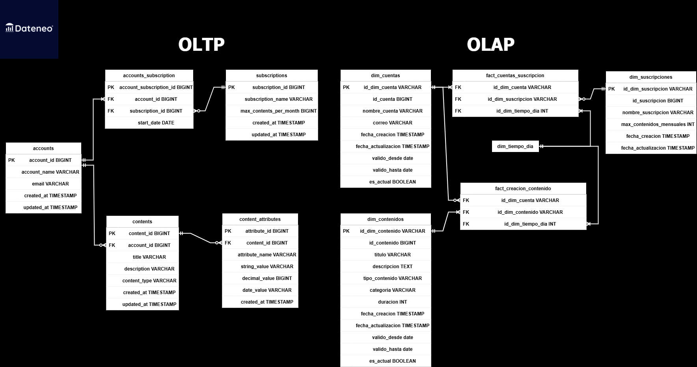

# SQL Modelado Dimensional

Este repositorio contiene scripts y recursos para la implementación de un modelo dimensional utilizando **DuckDB**.

Está diseñado para procesar datos de sistemas transaccionales y transformarlos en un modelo optimizado para análisis y reporting.

### OLTP vs OLAP

- **OLTP (Online Transaction Processing)**:
  - Diseñado para manejar operaciones transaccionales, como `accounts` o `content_attributes`.
  - En este contexto, las tablas contienen datos detallados y normalizados, como las suscripciones, cuentas y contenidos en sus versiones diarias e históricas.
  
- **OLAP (Online Analytical Processing)**:
  - Enfocado en el análisis de datos históricos y agregados, como el modelo dimensional implementado con dimensiones (`dim_suscripciones`, `dim_cuentas`, `dim_contenidos`, `dim_tiempo_dia`) y tablas de hechos (`fact_creacion_contenido`, `fact_cuentas_suscripcion`).
  - Las dimensiones contienen información descriptiva y gestionan cambios históricos (SCD), mientras que las tablas de hechos registran métricas y relaciones entre dimensiones.

El flujo de datos sigue este esquema:

1. Los datos normalizados del modelo OLTP se transforman y cargan en un modelo dimensional OLAP.
2. Este modelo OLAP es óptimo para realizar consultas analíticas y generar reportes.

### Visualización de los modelos de datos

A continuación, se incluye un diagrama entidad relación de ambos modelos:



## Estructura del proyecto

- **`datos/`**: scripts para la preparación de datos base y carga inicial de información en DuckDB.
  - `crea_base_duckdb.py`: Convierte archivos CSV a UTF-8, crea una base de datos DuckDB y carga los datos como tablas.
  - Archivos CSV con los datos originales.
  
- **`modelo_dimensional/`**: scripts SQL para la creación y carga de dimensiones y tablas de hechos.
  - Dimensiones: `dim_suscripciones.sql`, `dim_cuentas.sql`, `dim_contenidos.sql`, `dim_tiempo_dia.sql`.
  - Tablas de hechos: `fact_creacion_contenido.sql`, `fact_cuentas_suscripcion.sql`.
  - Script de carga: `carga_modelo.py`.

- **`recursos/`**: ejemplos y plantillas para conceptos como cambios SCD Tipo 1 y Tipo 2.

## Scripts python

Si bien no es necesario, si quieres ejecutar los scripts, asegúrate de instalar las librerías necesarias:

```bash
pip install duckdb charset_normalizer
